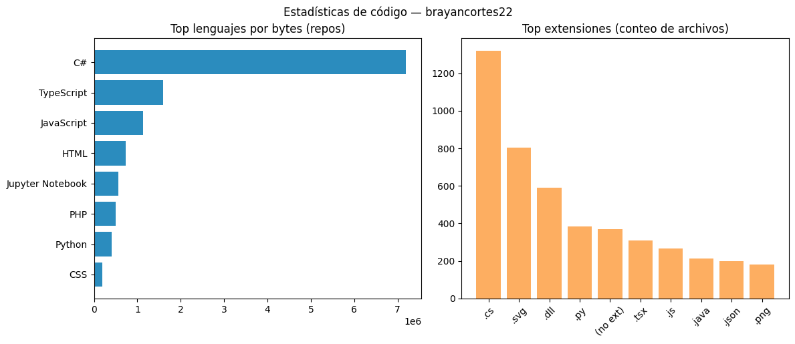

# BRAYAN STID CORTES LOMBANA

Desarrollador Full-Stack

---

<!-- Badges de contacto y despliegue -->

---

## Estadísticas de GitHub

Estas tarjetas muestran estadísitcas públicas de GitHub (si el nombre de usuario es correcto aparecerán datos reales):

## Sobre mí

Soy estudiante de Desarrollo de Software con título técnico y actualmente cursando el tecnólogo en Análisis y Desarrollo de Software en el SENA. Me estoy formando como desarrollador junior full‑stack, con experiencia en desarrollo frontend y backend. Busco retos que me permitan aplicar y ampliar mis conocimientos, mejorar mis habilidades técnicas y crecer como profesional en el mundo del software.

## Tecnologías y habilidades

- 🧭 Frontend: React, Vite, Tailwind CSS, HTML5, CSS3, JavaScript
- 🗄️ Backend: PHP, C#, Python
- 🛢️ Bases de datos: MySQL / SQL (integración y consultas)
- 🔧 Control de versiones: Git, GitHub
- ✅ Buenas prácticas: accesibilidad, rendimiento, optimización de carga

### Habilidades (visual)

## Experiencia

2023–2025 — Desarrollador Web Full‑Stack (proyectos propios y freelance)

- Desarrollo de landing pages modernas utilizando React + Vite y estilos con Tailwind CSS, enfocadas en velocidad de carga y experiencia de usuario.
- Creación de aplicaciones web funcionales con PHP y C#, integrando bases de datos y lógica del lado servidor.
- Gestión de proyectos personales para aprendizaje continuo, adopción de buenas prácticas y uso de control de versiones (Git).
- Participación en proyectos académicos dentro de mi formación en el SENA.

## Educación

- 2024–2025: Tecnólogo en Análisis y Desarrollo de Software — SENA (Servicio Nacional de Aprendizaje)
- 2023: Técnico en Análisis y Desarrollo de Software — Institución Educativa Juan XXIII
- 2023: Bachiller Académico

## Proyectos destacados

- **TecniApp** — Plataforma de servicios (despliegue): [https://tecniapp.netlify.app/](https://tecniapp.netlify.app/) — Proyecto desplegado con frontend moderno y optimizado.
- Landing pages y pequeños sitios de presentación: optimización con Vite y Tailwind.
- Aplicaciones con backend (PHP / C#) para manejo de datos y autenticación básica.
- Proyectos académicos realizados en el SENA enfocados en integración y buenas prácticas.

## Métricas de código (automáticas)

La imagen siguiente se genera automáticamente desde los repositorios públicos del usuario (lenguajes por bytes y conteo de extensiones). Se actualiza mediante un GitHub Action que ejecuta un script y sube la imagen a `assets/code_stats.png`.

## Contacto

<!-- Contacto mediante botones (evita mostrar datos en texto plano) -->

📍 Dirección (clic para mostrar)

Cl 29oe #5w-16, Santa Inés, Neiva‑Huila, Colombia

---

