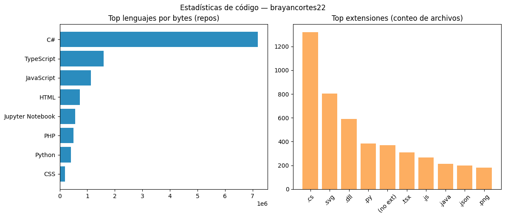

# BRAYAN STID CORTES LOMBANA

**Desarrollador Full-Stack | Ecosistema Microsoft (.NET, C#, Dynamics 365 F&O) & Frontend Moderno (React, TypeScript)**

  
  
  
  
  

---

## 👨‍💻 Perfil Profesional

Desarrollador Full-Stack especializado en el **ecosistema Microsoft** y tecnologías de **frontend moderno**. Experiencia sólida en la construcción de soluciones empresariales utilizando **C#, .NET, X++ (Dynamics 365 Finance & Operations), React y .NET MAUI**. Orientado a la arquitectura de software escalable, aplicando principios **SOLID** y metodologías de **Clean Code** para garantizar la mantenibilidad, seguridad y eficiencia a nivel de base de datos e integraciones.

📍 **Ubicación:** Neiva, Huila, Colombia  
📞 **Teléfono / WhatsApp:** [+57 310 2944 906](https://wa.me/573102944906)  
✉️ **Correo:** [brayanstidcorteslombana@gmail.com](mailto:brayanstidcorteslombana@gmail.com)  

---

## 💼 Experiencia Profesional

### **Desarrollador Dynamics 365**
**Software Resources Factory S.A.S** | *2026 (6 meses)*
- **Personalizaciones & Extensiones:** Desarrollo de personalizaciones y extensiones para **Microsoft Dynamics 365 Finance & Operations** utilizando **X++**.
- **Lógica de Negocio & Formularios:** Modificación e implementación de clases de delegación, formularios de cotizaciones de ventas y reportes de órdenes de compra (SSRS) directamente en Visual Studio.
- **Entidades de Datos & Depuración:** Extensión de entidades de datos (`WHSShipmentSalesTableEntity` y tablas de staging) y depuración técnica de transacciones de inventario (`PurchLine`, `InventTransId`).

---

## 🚀 Proyectos Destacados

### 💎 [Accesorios Lilís — Plataforma Web Oficial & E-Commerce Artesanal](https://accesorios-lilis-2026.vercel.app)
> **Producción en Vivo:** [accesorios-lilis-2026.vercel.app](https://accesorios-lilis-2026.vercel.app) | **Repositorio:** [github.com/brayancortes22/accesorios-lilis](https://github.com/brayancortes22/accesorios-lilis)

Plataforma de comercio electrónico y catálogo interactivo creada para el taller artesanal de bisutería y piezas hechas a mano en Algeciras (Huila).
- **Arquitectura Full-Stack:** Frontend desacoplado con React 19, TypeScript estricto, hooks personalizados (`useAuth`, `useCart`, `useProducts`) y API REST con ASP.NET Core y Entity Framework Core.
- **Seguridad & Autenticación Dinámica:** Flujo de verificación de email en 2 pasos, hashing criptográfico de contraseñas con PBKDF2-SHA256 (100.000 iteraciones), JWT Bearer tokens e integración oficial de **Google Identity Services (Google OAuth SSO)**.
- **Roles y Gestión:** Panel administrativo de control de inventario, administración de pedidos con trazabilidad de paquetería y enlace directo a WhatsApp para atención al cliente.
- **DevOps y Automatización:** Pipeline CI/CD con GitHub Actions escalonado (`development` → `qa` → `main`) con chequeo estricto de TypeScript en cada fase y script local de automatización en un clic ([`escalar.bat`](file:///c:/Users/NITRO%20ACER/Desktop/proyectos%20con%20ia/Accesorios%20lilis/escalar.bat)).
- **SEO Avanzado & Presencia Digital:** Verificación oficial en Google Search Console, Schema.org `JewelryStore` con geolocalización satelital, mapa interactivo oficial de **Google Maps** (taller y punto de venta) y metadatos OpenGraph.

---

### 🎓 Portal de Autogestión SENA — Plataforma Web & Móvil
> **Rol:** Desarrollador Full-Stack

Plataforma integral desarrollada para la administración y asignación eficiente de instructores de etapa productiva.
- **Backend Robusto:** Lógica de negocio y endpoints RESTful con Python y Django, gestionando persistencia relacional con MySQL.
- **Frontend Moderno:** Interfaz web en React con TypeScript garantizando modularidad y componentes tipados.
- **Aplicación Móvil:** Desarrollo de la versión móvil nativa multiplataforma utilizando **.NET MAUI**.
- **Ingeniería de Software:** Modelado entidad-relación en Draw.io, mockups y prototipos UI/UX en Figma, y aseguramiento de calidad con pruebas unitarias y de integración en C#.

---

### ⚡ [TecniApp — Plataforma de Servicios](https://tecniapp.netlify.app/)
> **Producción en Vivo:** [tecniapp.netlify.app](https://tecniapp.netlify.app/)

Aplicación web moderna orientada a la gestión y solicitud de servicios técnicos, enfocada en alta velocidad de carga, diseño responsivo y optimización de experiencia de usuario.

---

## 🛠️ Habilidades Técnicas

| Área | Tecnologías y Herramientas |
| :--- | :--- |
| **Backend & ERP** | C#, ASP.NET Core Web API, X++ (Dynamics 365 F&O), Python (Django), LINQ, Entity Framework Core, PHP |
| **Frontend & Mobile** | React 19, TypeScript, JavaScript (ES6+), .NET MAUI, Vite, HTML5, CSS3 Modular, Tailwind CSS |
| **Bases de Datos** | SQL Server, MySQL, Entity Framework, Modelado relacional |
| **Arquitectura & Metodologías** | Clean Code, Principios SOLID, Arquitectura en Capas, APIs RESTful |
| **DevOps & Nube** | GitHub Actions (CI/CD Pipelines), Azure DevOps, Git, GitHub, Vercel, Netlify, Linux |
| **Seguridad & APIs** | OAuth 2.0 / Google Identity SSO, JWT Bearer, PBKDF2-SHA256, Google Maps API, Google Search Console |

---

## 🎓 Educación

- **Tecnólogo en Análisis y Desarrollo de Software**  
  *SENA (Servicio Nacional de Aprendizaje) — Neiva, Colombia* | **2024 – 2026**
- **Técnico en Análisis y Desarrollo de Software**  
  *SENA — Algeciras, Huila, Colombia* | **2022 – 2023**
- **Bachiller Académico**  
  *Institución Educativa Juan XXIII — Algeciras, Huila, Colombia* | **2023**

---

## 🌐 Idiomas

- **Español:** Nativo
- **Inglés:** A2 (Lectura técnica y comprensión de documentación)

---

## 📊 Métricas de Código

---

## 📬 Contacto

¿Tienes un proyecto en mente o una propuesta laboral? Estaré encantado de conversar:

  
  
  

📍 Ubicación detallada

Neiva, Huila, Colombia

---
*Perfil actualizado y mantenido con control de versiones.*
