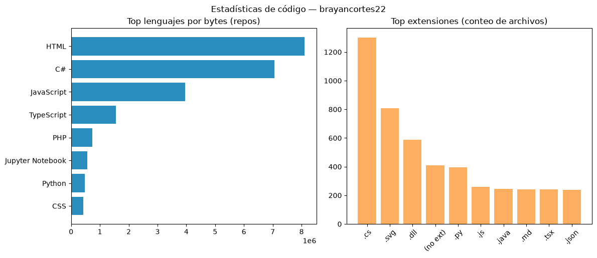

# BRAYAN STID CORTES LOMBANA

**Desarrollador Full-Stack | Ecosistema Microsoft (.NET, C#, Dynamics 365 F&O) & Frontend Moderno (React, TypeScript)**

  
  
  
  
  
  
  

---

## 👨‍💻 Perfil Profesional

Desarrollador Full-Stack especializado en el **ecosistema Microsoft (.NET 10, C#)**, **procesamiento de datos analíticos de alto rendimiento (DuckDB OLAP)** y **frontend moderno con gráficos 3D (React 19, TypeScript, Three.js / WebGL)**. Experiencia sólida en la construcción de soluciones empresariales y científicas utilizando **C#, .NET, X++ (Dynamics 365 Finance & Operations), React, Android Nativo (Kotlin) y .NET MAUI**. Orientado a la arquitectura de software escalable, aplicando principios **SOLID**, metodologías de **Clean Architecture** y flujos **CI/CD** automatizados para garantizar la mantenibilidad, seguridad y rendimiento a nivel de base de datos e integraciones.

📍 **Ubicación:** Neiva, Huila, Colombia  
📞 **Teléfono / WhatsApp:** [+57 310 2944 906](https://wa.me/573102944906)  
✉️ **Correo:** [brayanstidcorteslombana@gmail.com](mailto:brayanstidcorteslombana@gmail.com)  

---

## 💼 Experiencia Profesional

### **Desarrollador Dynamics 365**
**Software Resources Factory S.A.S** | *2026 (6 meses)*
- **Personalizaciones & Extensiones:** Desarrollo de personalizaciones y extensiones para **Microsoft Dynamics 365 Finance & Operations** utilizando **X++**.
- **Lógica de Negocio & Formularios:** Modificación e implementación de clases de delegación, formularios de cotizaciones de ventas y reportes de órdenes de compra (SSRS) directamente en Visual Studio.
- **Entidades de Datos & Depuración:** Extensión de entidades de datos (`WHSShipmentSalesTableEntity` y tablas de staging) y depuración técnica de transacciones de inventario (`PurchLine`, `InventTransId`).

---

## 🚀 Proyectos Destacados

### 🌍 [NASA Earth System Trend Detective — Observatorio Climático 3D & Motor Analítico](https://nasa-earth-trend-detective.vercel.app)
> **Despliegue en Vivo:** [nasa-earth-trend-detective.vercel.app](https://nasa-earth-trend-detective.vercel.app/) | **Organización:** [github.com/nasa-earth-detectives](https://github.com/nasa-earth-detectives/nasa-earth-trend-detective) | **Mirror Personal:** [github.com/brayancortes22/nasa-earth-trend-detective](https://github.com/brayancortes22/nasa-earth-trend-detective)  
> **Evento:** NASA International Space Apps Challenge 2026 | **Rol:** Frontend Lead & Full-Stack Architect

Plataforma científica global e interactiva para la detección, modelado y visualización de tendencias climáticas y anomalías terrestres a partir de datos satelitales oficiales de la NASA.
- **Observatorio 3D Inmersivo (GPU Accelerated):** Globo orbital interactivo a 60 FPS desarrollado con Three.js y Globe.gl, integrando cálculo astronómico en tiempo real del punto subsolar UTC, sombras de luz solar, textura de relieve terrestre y capas de contraste térmico.
- **Motor OLAP Columnar de Alto Rendimiento:** Backend en .NET 10 con DuckDB embebido y esquema analítico estrella (`fact_climate_observations`, dimensiones temporales y espaciales), ejecutando consultas y agregaciones Parquet sobre cientos de miles de registros en menos de 50 ms.
- **Pipeline ETL Satelital NASA:** Extractores y normalizadores de coordenadas a grilla canónica WGS84 para datasets satelitales (GISTEMP v4, MODIS NDVI, GRACE Mascon y OCO-2 XCO2), incorporando caché atómica en disco y resiliencia con Microsoft HTTP Resilience (Polly).
- **Gobernanza & DevOps Estricto:** Arquitectura Git Flow de 3 ramas (`development` ➔ `qa` ➔ `production`), Rulesets de protección contra force push, verificación automatizada de autoría limpia mediante GitHub Actions y despliegue continuo en Vercel Edge y Render.

---

### 💎 [Accesorios Lilís — Plataforma Web Oficial & E-Commerce Artesanal](https://accesorios-lilis-2026.vercel.app)
> **Producción en Vivo:** [accesorios-lilis-2026.vercel.app](https://accesorios-lilis-2026.vercel.app) | **Repositorio:** [github.com/brayancortes22/accesorios-lilis](https://github.com/brayancortes22/accesorios-lilis)

Plataforma de comercio electrónico y catálogo interactivo creada para el taller artesanal de bisutería y piezas hechas a mano en Algeciras (Huila).
- **Arquitectura Full-Stack:** Frontend desacoplado con React 19, TypeScript estricto, hooks personalizados (`useAuth`, `useCart`, `useProducts`) y API REST con ASP.NET Core y Entity Framework Core.
- **Seguridad & Autenticación Dinámica:** Flujo de verificación de email en 2 pasos, hashing criptográfico de contraseñas con PBKDF2-SHA256 (100.000 iteraciones), JWT Bearer tokens e integración oficial de **Google Identity Services (Google OAuth SSO)**.
- **Roles y Gestión:** Panel administrativo de control de inventario, administración de pedidos con trazabilidad de paquetería y enlace directo a WhatsApp para atención al cliente.
- **DevOps y Automatización:** Pipeline CI/CD con GitHub Actions escalonado (`development` → `qa` → `main`) con chequeo estricto de TypeScript en cada fase y script local de automatización en un clic ([`escalar.bat`](file:///c:/Users/NITRO%20ACER/Desktop/proyectos%20con%20ia/Accesorios%20lilis/escalar.bat)).
- **SEO Avanzado & Presencia Digital:** Verificación oficial en Google Search Console, Schema.org `JewelryStore` con geolocalización satelital, mapa interactivo oficial de **Google Maps** (taller y punto de venta) y metadatos OpenGraph.

---

### 🎮 Game Translator — Traductor Flotante en Pantalla para Android (On-Device & Offline ML)
> **Rol:** Diseñador y Desarrollador Android Nativo | **Arquitectura:** Foreground Service & MediaProjection

Herramienta nativa para Android de traducción de videojuegos móviles on-demand y en tiempo real, diseñada para jugadores de títulos MMORPG y Survival (LifeAfter, etc.) con textos en inglés o idiomas asiáticos.
- **Burbuja Flotante Overlay & Cero Interrupción:** Interfaz accesible en todo momento sobre la partida mediante Android `WindowManager` (`TYPE_APPLICATION_OVERLAY`) sin bloquear el gameplay ni requerir salir de la app.
- **100% On-Device & Protección de Datos:** Procesamiento de OCR (Reconocimiento Óptico de Caracteres) y traducción neuronal completamente local con Google ML Kit, garantizando cero consumo de datos móviles y privacidad absoluta.
- **Garantía Antiban (Seguridad de Proyección):** Captura de pantalla no intrusiva a través de la API oficial de Android `MediaProjection`, sin manipular la memoria RAM ni inyectar código en los ejecutables del juego.
- **Modo Francotirador (Sniper / Crop):** Selección táctil dinámica de regiones de pantalla para traducir únicamente diálogos específicos, cartas o menús, con caché en memoria (0 ms) para textos recurrentes y diseño Glassmorphic translúcido.

---

### 🎓 [Portal de Autogestión SENA — Plataforma Web & Móvil Integral](https://autogestion-sena.vercel.app)
> **Producción en Vivo:** [autogestion-sena.vercel.app](https://autogestion-sena.vercel.app) | **API & Swagger UI:** [autogestion-sena-api.onrender.com/swagger/](https://autogestion-sena-api.onrender.com/swagger/) | **Health Monitor:** [autogestion-sena-api.onrender.com/health](https://autogestion-sena-api.onrender.com/health)  
> **Repositorios GitHub:** [Backend Web API](https://github.com/July173/Back-end-web-API-autogestionSena) · [Frontend Web](https://github.com/July173/autogestionFrontWeb) · [Frontend Móvil](https://github.com/July173/FrontMovilAutogestion)  
> **Rol:** Full-Stack Lead & Software Architect

Plataforma empresarial de autogestión académica y control de etapa productiva para el SENA, con soporte multiplataforma (Web y Móvil) y gestión en tiempo real.
- **Clean Architecture en 4 Capas (Backend):** Arquitectura desacoplada en Python 3.12 y Django 5 con separación estricta en `Entities` (ORM relacional), `Repositories` (persistencia desacoplada), `Services` (reglas de negocio y transacciones atómicas) y `ViewSets` (entrega HTTP delgada con documentación automática en Swagger/OpenAPI).
- **Frontend React 19 & Custom Hooks:** Interfaz reactiva en TypeScript gobernada por Custom Hooks (`useRoles`, `useForms`, `useInstructorAssignments`), Fachada de registro centralizado de endpoints (`ConfigApi.ts` anti-hardcoding), watchdog de expiración de sesión por inactividad (`useIdleTimer`) y bundle splitting optimizado con Vite Rollup chunks (reducción de 1.9 MB a 601 kB).
- **Asincronía & Automatización con Celery:** Procesamiento en segundo plano con Redis y planificador Celery Beat para tareas recurrentes programadas a nivel de servidor (evaluación y desactivación automática de instructores vencidos a las 00:01 AM).
- **Notificaciones Push en Tiempo Real:** Comunicación bidireccional mediante protocolo WebSocket con Django Channels y servidor ASGI Daphne para alertas instantáneas de novedades a aprendices, instructores y coordinadores.
- **ETL & Sincronización Masiva Sofia Plus:** Pipeline de importación y procesamiento en streaming de archivos Excel (`.xlsx`) mediante `openpyxl`, con validación semántica fila por fila y generación de reportes de error.
- **Cliente Móvil Multiplataforma (.NET MAUI):** Aplicación nativa en C# para Android y Windows con arquitectura espejo de consumo de API (`Endpoints.cs`), persistencia de tokens JWT y 2FA institucional.

---

### ⚡ [TecniApp — Plataforma de Servicios](https://tecniapp.netlify.app/)
> **Producción en Vivo:** [tecniapp.netlify.app](https://tecniapp.netlify.app/)

Aplicación web moderna orientada a la gestión y solicitud de servicios técnicos, enfocada en alta velocidad de carga, diseño responsivo y optimización de experiencia de usuario.

---

## 🛠️ Habilidades Técnicas

| Área | Tecnologías y Herramientas |
| :--- | :--- |
| **Backend & ERP** | C# (.NET 10 / ASP.NET Core Web API), X++ (Dynamics 365 F&O), Python (Django 5 REST Framework), Celery, Redis, Django Channels (WebSockets/Daphne), LINQ, Entity Framework Core, Polly (Resilience), PHP |
| **Bases de Datos & OLAP** | DuckDB (Motor OLAP columnar embebido), Apache Parquet, SQL Server, MySQL 8.4 (Aiven Cloud), Modelado Relacional & Esquema Estrella |
| **Frontend & Gráficos 3D** | React 19, TypeScript, Three.js / Globe.gl (WebGL 3D 60 FPS), Custom Hooks, JavaScript (ES6+), Vite, Tailwind CSS, Glassmorphism UI |
| **Móvil & Machine Learning** | Android Nativo (Kotlin), Google ML Kit (OCR & On-Device Translation), MediaProjection, .NET MAUI (C#) |
| **Arquitectura & Metodologías** | Clean Code, Principios SOLID, Clean Architecture en 4 capas (Entity-Repo-Service-ViewSet), DDD Simplificado, APIs RESTful, DTOs, Endpoint Facade |
| **DevOps & Nube** | GitHub Actions (CI/CD Multi-Branch: `development` / `qa` / `production`), Docker, Azure DevOps, Git, Vercel Edge, Render, Netlify, Linux |
| **Seguridad & APIs** | 2FA TOTP, OAuth 2.0 / Google Identity SSO, JWT Bearer, PBKDF2-SHA256, OpenAPI / Swagger (drf-yasg), openpyxl (Streaming Excel), NASA EarthData API / CMR, Google Maps API |

---

## 🎓 Educación

- **Tecnólogo en Análisis y Desarrollo de Software**  
  *SENA (Servicio Nacional de Aprendizaje) — Neiva, Colombia* | **2024 – 2026**
- **Técnico en Análisis y Desarrollo de Software**  
  *SENA — Algeciras, Huila, Colombia* | **2022 – 2023**
- **Bachiller Académico**  
  *Institución Educativa Juan XXIII — Algeciras, Huila, Colombia* | **2023**

---

## 🌐 Idiomas

- **Español:** Nativo
- **Inglés:** A2 (Lectura técnica y comprensión de documentación)

---

## 📊 Métricas de Código

---

## 📬 Contacto

¿Tienes un proyecto en mente o una propuesta laboral? Estaré encantado de conversar:

  
  
  

📍 Ubicación detallada

Neiva, Huila, Colombia

---
*Perfil actualizado y mantenido con control de versiones.*
